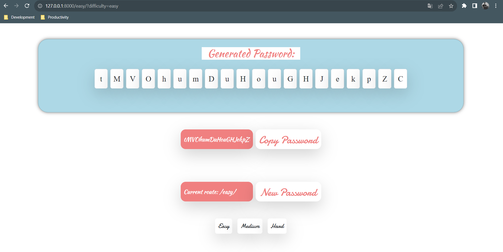

# Password_Generator


##   Password Generator Application

> Проект на Django для генерации паролей в зависимости от указанного пути в URL.Этот проект представляет собой веб-приложение на Django, которое генерирует пароли в соответствии с указанным путем в URL.Пароли будут генероваться в интервале (8, 20).



**Пример программы так работает.**


## Установка

**Для установки программы, выполните следующие шаги:**

1. Установите Python на вашу систему, если он еще не установлен. Вы можете скачать Python с официального сайта: https://www.python.org/downloads/

2. Клонируйте репозиторий с GitHub:
 ```bash
$  git clone https://github.com/Humoyun004/Password_Generator.git
```

3. Перейдите в директорию с программой:
cd Password_Generator


## Использование
1.  Перейдите в браузере по адресу http://localhost:8000/.
2. В URL добавьте один из следующих путей, чтобы сгенерировать пароль определенной сложности:
    - `easy/` - генерирует пароль длиной более 8 символов, состоящий только из букв верхнего и нижнего регистра.
    - `medium/` - генерирует пароль длиной более 8 символов, состоящий из букв верхнего и нижнего регистра, а также цифр.
    - `hard/` - генерирует пароль длиной более 8 символов, состоящий из букв верхнего и нижнего регистра, цифр и специальных символов.

## Вклад
**Если вы хотите внести свой вклад в развитие приложения "Password_Generator", пожалуйста, следуйте этим шагам:**

1. Форкните репозиторий на GitHub.
2. Клонируйте ваш форк репозитория на локальную машину.
3. Создайте новую ветку для вашей функции или исправления ошибки.
4. Внесите изменения и сделайте коммиты с описательными сообщениями.
5. Отправьте ваши изменения в ваш форк репозитория.
6. Создайте pull request (запрос на включение) в основной репозиторий.

## Благодарности
- Фреймворк Django: https://www.djangoproject.com/
- Фреймворк Bootstrap: https://getbootstrap.com/

## Дополнительные ресурсы
- **Документация Django:** https://docs.djangoproject.com/

## Контакты
**Если у вас есть вопросы или предложения относительно приложения "Password_Generator", пожалуйста, свяжитесь с нами по адресу humoyunakbaraliev1@gmail.com. Мы ценим ваше мнение!**


